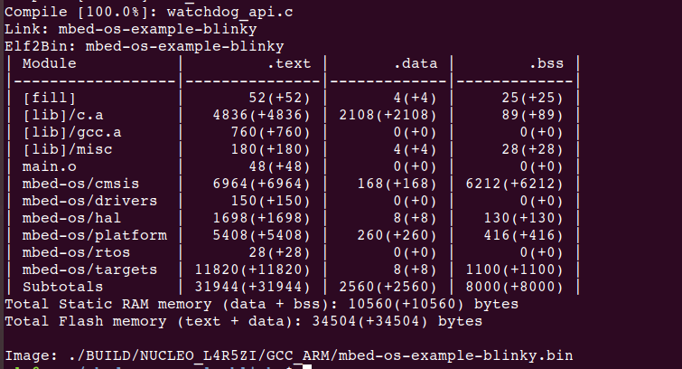
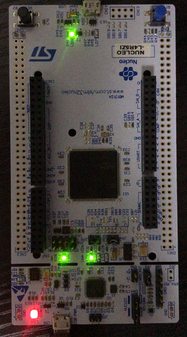

# mbedOS移植到STM32L4R5ZI开发板

**说明：本次的操作基于虚拟机完成，搭载系统为Ubuntu18.04。**

## 安装依赖的软件

* 安装Git
    > sudo apt install git -y

* 安装Python
    > sudo apt install python3 python3-pip -y

* 安装Mercurial
    > sudo apt install mercurial -y

## 安装Mbed-CLI

* 安装
    > python3 -m pip install mbed-cli

    安装完成后，注销一下虚拟机，启动后可通过如下命令，验证结果：
    > mbed --version  
    > mbed-cli --version

    如下图表示安装成功：  
    

* 升级
    > python3 -m pip install -U mbed-cli  

## 下载交叉编译工具链

当前支持的工具链有两种Arm Compiler和GNU Arm Embedded Compiler，本次我们选择GNU Arm Embedded Compiler，下载地址为：[gcc-arm-none-eabi-9-2019-q4-major-x86_64-linux.tar.bz2](https://developer.arm.com/-/media/Files/downloads/gnu-rm/9-2019q4/gcc-arm-none-eabi-9-2019-q4-major-x86_64-linux.tar.bz2?revision=108bd959-44bd-4619-9c19-26187abf5225&la=en&hash=E788CE92E5DFD64B2A8C246BBA91A249CB8E2D2D)

下载、解压完成后，将交叉编译工具链放置在${HOME}/opt目录下；

配置系统的环境变量，修改.bashrc文件，在文件的末尾添加如下内容：  
> export PATH=$PATH:${HOME}/opt/gcc-arm-none-eabi-9-2019-q4-major/bin

添加完成后，可用如下命令，验证配置是否生效：  
> arm-none-eabi-gcc -v

正确完成后，结果如下：  

## 配置mbed

可使用如下命令配置mbed交叉编译工具的路径：  
> mbed config -G GCC_ARM_PATH "${HOME}/opt/gcc-arm-none-eabi-9-2019-q4-major/bin"

配置完成后，确认配置是否生效：
> mbed config --list

正确完成时，结果如下：  

## 导入官方的示例

mbedOS在官方仓库中提供了众多的[示例](https://github.com/ARMmbed)，本次我们选择`mbed-os-example-blinky`演示开发流程。

可以使用如下命令导入`mbed-os-example-blinky`：  
> mbed import mbed-os-example-blinky

中间拉取`mbed-os`，由于网速，可能会失败，如果失败，可以执行如下命令，继续同步动作：  
> mbed deploy

同步完成后，`mbed-os-example-blinky`目录中有如下内容：  

## 生成针对STM32L4R5ZI开发板的bin文件

执行如下命令：  
> mbed compile -m NUCLEO_L4R5ZI -t GCC_ARM

    -m 选项指定目标开发板  
    -t 选项指定使用的交叉编译器  

编译完成后，结果如下：  

在BUILD/NUCLEO_L4R5ZI/GCC_ARM目录下生成了mbed-os-example-blinky.bin，可以将bin文件下载到板子中，按下板子的Reset按键，看到板子对应的LED灯以500ms的频率闪烁。

