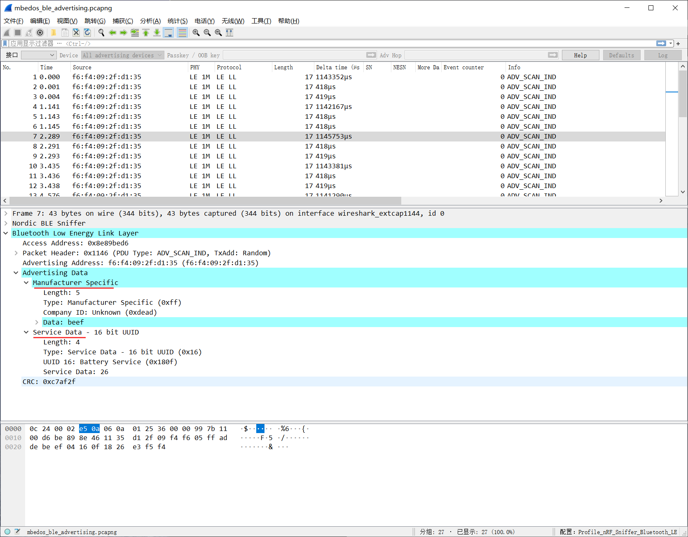
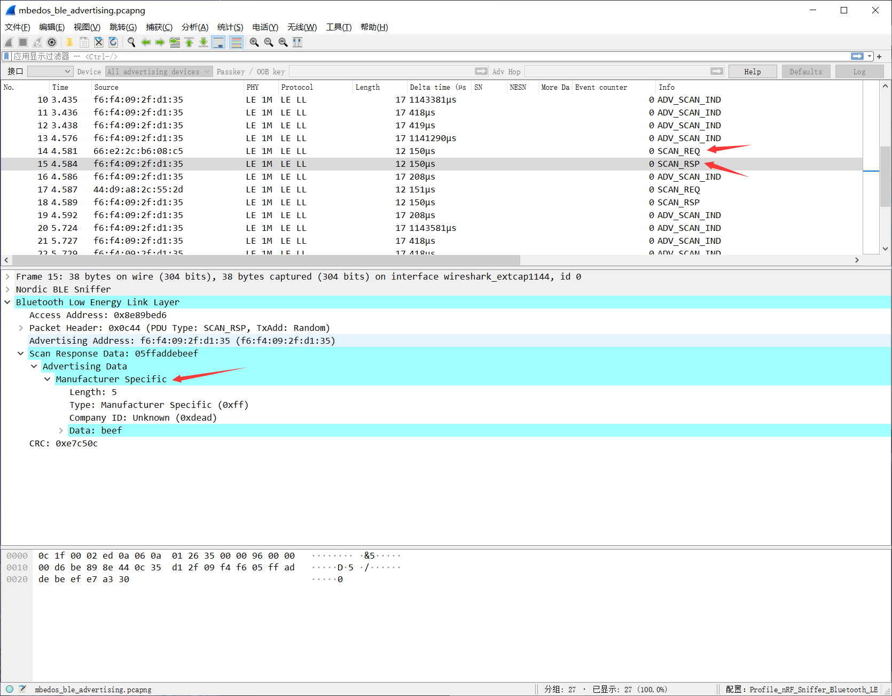

# BLE_Advertising

本节内容介绍了 mbed os 里 BLE_Advertising 例程里关于打广播的内容。尽可能地从宏观上去了解 mbed os 里 BLE 协议栈是如何打广播的，因此需要充分理解函数名，变量名等与 BLE 广播之间的联系。关于细节部分以后再添加。

## example 介绍

### BatteryDemo 接口

BatteryDemo 类声明里 public 类型的成员只有一个构造函数和一个 `start()` 方法，因此接口就只有 `start()`，可以在 main 函数里看见创建一个 BatteryDemo 对象后就直接调用了 `start()` 方法。

```C
void start()
{
    /* mbed will call on_init_complete when when ble is ready */
    _ble.init(this, &BatteryDemo::on_init_complete);

    /* this will never return */
    _event_queue.dispatch_forever();
}
```

第 4 行初始化 BLE 协议栈，通过注释可以知道 BLE 协议栈初始化完成后会调用 `on_init_complete` 这个成员函数。第 7 行涉及到 mbed os 里的事件机制，我还没弄懂，而且这对我们理解 BLE 没有影响，在这里就不介绍了。

### on_init_complete

```C
/** Callback triggered when the ble initialization process has finished */
void on_init_complete(BLE::InitializationCompleteCallbackContext *params)
{
    if (params->error != BLE_ERROR_NONE) {
        print_error(params->error, "Ble initialization failed.");
        return;
    }

    print_mac_address();

    start_advertising();
}
```

这个函数首先打印了设备的 mac 地址，这个地址可以在抓包的时候用于过滤使用。

之后就开始打广播了。

### start_advertising

这个函数里内容挺多的，可以分成设置广播参数、设置广播数据、设置扫描回复数据、开始广播这四个部分。

#### 设置广播参数

```C
/* create advertising parameters and payload */

ble::AdvertisingParameters adv_parameters(
    /* you cannot connect to this device, you can only read its advertising data,
             * scannable means that the device has extra advertising data that the peer can receive if it
             * "scans" it which means it is using active scanning (it sends a scan request) */
    ble::advertising_type_t::SCANNABLE_UNDIRECTED,
    ble::adv_interval_t(ble::millisecond_t(1000))
);

ble_error_t error = _ble.gap().setAdvertisingParameters(
    ble::LEGACY_ADVERTISING_HANDLE,
    adv_parameters
);

if (error) {
    print_error(error, "_ble.gap().setAdvertisingParameters() failed");
    return;
}
```

这里设置了一个广播参数 `adv_parameters`，其中广播包类型为 `SCANNABLE_UNDIRECTED` ，即可扫描、不定向包，也就是 ADV_SCAN_IND 这个包。然后又设置了发送间隔时间为 1000ms 。

之后将该广播参数通过 `_ble.gap().setAdvertisingParameters` 设置到 BLE 协议栈里。

#### 设置广播数据

```C
_adv_data_builder.setFlags();
_adv_data_builder.setName(DEVICE_NAME);

/* we add the battery level as part of the payload so it's visible to any device that scans */
_adv_data_builder.setServiceData(GattService::UUID_BATTERY_SERVICE, {&_battery_level, 1});

error = _ble.gap().setAdvertisingPayload(
    ble::LEGACY_ADVERTISING_HANDLE,
    _adv_data_builder.getAdvertisingData()
);

if (error) {
    print_error(error, "_ble.gap().setAdvertisingPayload() failed");
    return;
}
```

在 BatteryDemo 类里定义了一个私有成员 `ble::AdvertisingDataBuilder _adv_data_builder;` ，通过名字可以看出用于构建广播数据包。

然后开始构建广播数据包，也就是那 31 个字节。

- 调用 `setFlags()` ，
  - 此时是在构建 AD Type 为 0x01 - «Flags» 的 AD Structure ，
  - 其 AD Data 默认为 `BREDR_NOT_SUPPORTED | LE_GENERAL_DISCOVERABLE` ，
  - Length 字段会自动设置。
- 调用 `setName()`，
  - 此时是在构建 AD Type 为 0x09 - «Complete Local Name» 的 AD Structure，
  - 其 AD Data 为 `DEVICE_NAME` ，在文件最开始处有定义 `const static char DEVICE_NAME[] = "BATTERY";` ，
  - Length 字段会自动设置。
- 调用 `setServiceData()`，
  - 此时是在构建 AD Type 为 0x16 - «Service Data» 的 AD Structure，
  - 其 AD Data 包括 Service UUID 和 Service Data。Service UUID 为 `GattService::UUID_BATTERY_SERVICE` ，也就是 0x180F ，Service Data 就是一个字节的电量 `_battery_level` 。
  - Length 字段会自动设置。

之后通过 `_ble.gap().setAdvertisingPayload` 设置广播包（此处为 ADV_SCAN_IND）的负载数据。

#### 设置扫描回复数据

```C
/* when advertising you can optionally add extra data that is only sent
         * if the central requests it by doing active scanning */
_adv_data_builder.clear();
const uint8_t _vendor_specific_data[4] = { 0xAD, 0xDE, 0xBE, 0xEF };
_adv_data_builder.setManufacturerSpecificData(_vendor_specific_data);

_ble.gap().setAdvertisingScanResponse(
    ble::LEGACY_ADVERTISING_HANDLE,
    _adv_data_builder.getAdvertisingData()
);
```

首先用 `clear()` 清空广播包数据。

调用 `setManufacturerSpecificData()` 构建 AD Structure:

- AD Type 为 0xFF - «Manufacturer Specific Data»
- AD Data 为 `_vendor_specific_data`，在上面有定义，Company ID 为 0xdead，Data 为 0xbeef 。
- Length 字段协议栈自动填充。

然后调用 `_ble.gap().setAdvertisingScanResponse` 设置扫描回复包（SCAN_RSP）的负载数据。

#### 开始广播

```C
/* start advertising */

error = _ble.gap().startAdvertising(ble::LEGACY_ADVERTISING_HANDLE);

if (error) {
    print_error(error, "_ble.gap().startAdvertising() failed");
    return;
}

/* we simulate battery discharging by updating it every second */
_event_queue.call_every(
    1000ms,
    [this]() {
        update_battery_level();
    }
);
```

上述代码就正式开启了广播，同时还定义了每秒执行 `update_battery_level()` 函数的事件。

### update_battery_level

```C
void update_battery_level()
{
    if (_battery_level-- == 10) {
        _battery_level = 100;
    }

    /* update the payload with the new value */
    ble_error_t error = _adv_data_builder.setServiceData(GattService::UUID_BATTERY_SERVICE, make_Span(&_battery_level, 1));

    if (error) {
        print_error(error, "_adv_data_builder.setServiceData() failed");
        return;
    }

    /* set the new payload, we don't need to stop advertising */
    error = _ble.gap().setAdvertisingPayload(
        ble::LEGACY_ADVERTISING_HANDLE,
        _adv_data_builder.getAdvertisingData()
    );

    if (error) {
        print_error(error, "_ble.gap().setAdvertisingPayload() failed");
        return;
    }
}
```

在该函数里，模拟电量每秒减 1，减到 10 时又回到 100，如此往复。

然后又构建了 «Service Data» 的广播包，使用更新过的电量作为 Service Data 。重新设置广播负载数据。

注意之前设置的 «Manufacturer Specific Data» 数据没有在 `_adv_data_builder` 里清空，所以在发送的 ADV_SCAN_IND 的广播包里也能看到 «Manufacturer Specific Data» 这个 AD Structure 。

## mbedos_ble_advertising 抓包文件分析



可以看见 WB55 周期性的在发送 ADV_SCAN_IND 的包，里面有两个 AD Structure ，其中一个是 Service Data 的类型的包，AD Data 包括 0x180f（Battery Service UUID）和 0x26（电量）。



当手机端开启扫描模式后，会发现 WB55 发送了 ADV_SCAN_RSP 的包，里面包含了一个 AD Structure，AD Type 为 0xff（Manufacturer Specific）。

WB55 在上电复位的时候也会发送一个广播包，有 3 个 AD Structure ，但那个包我没抓到，就没有写。

## ble::AdvertisingDataBuilder

mbed os [AdvertisingDataBuilder API 文档](https://os.mbed.com/docs/mbed-os/v6.4/mbed-os-api-doxy/classble_1_1_advertising_data_builder.html) 。

AdvertisingDataBuilder 这个类主要用于构建广播数据，该类有一系列的成员函数，可以帮助我们方便地构建 AD Structure 。

一个 AD Structure 由 **Length**, **AD Type**, **AD Data** 这三个部分组成。

可在 [https://www.bluetooth.com/specifications/assigned-numbers/generic-access-profile/ ](https://www.bluetooth.com/specifications/assigned-numbers/generic-access-profile/) 网址找到蓝牙联盟定义的所有 AD Type 。

常用广播 AD Type 及相应接口如下：

| Data Type Value | Data Type Name               | AdvertisingDataBuilder                                       |
| --------------- | ---------------------------- | ------------------------------------------------------------ |
| 0x01            | «Flags»                      | [setFlags](https://os.mbed.com/docs/mbed-os/v6.4/mbed-os-api-doxy/classble_1_1_advertising_data_builder.html#a32d9a40ff895015ac3a66a1fc137c194) ([adv_data_flags_t](https://os.mbed.com/docs/mbed-os/v6.4/mbed-os-api-doxy/structble_1_1adv__data__flags__t.html) flags=adv_data_flags_t::default_flags) |
| 0x03            | «16-bit Service Class UUIDs» | [setLocalServiceList](https://os.mbed.com/docs/mbed-os/v6.4/mbed-os-api-doxy/classble_1_1_advertising_data_builder.html#af3f1587af99e161e0bc343470c35dfa5) ([mbed::Span](https://os.mbed.com/docs/mbed-os/v6.4/mbed-os-api-doxy/structmbed_1_1_span.html)< const [UUID](https://os.mbed.com/docs/mbed-os/v6.4/mbed-os-api-doxy/class_u_u_i_d.html) > data, bool complete=true) |
| 0x09            | «Complete Local Name»        | [setName](https://os.mbed.com/docs/mbed-os/v6.4/mbed-os-api-doxy/classble_1_1_advertising_data_builder.html#ab4d580cb27de2a0d573a6074f4f97b64) (const char *name, bool complete=true) |
| 0x16            | «Service Data»               | [setServiceData](https://os.mbed.com/docs/mbed-os/v6.4/mbed-os-api-doxy/classble_1_1_advertising_data_builder.html#a62a7275a0cfa9eadee34eb50f3f5c3cf) ([UUID](https://os.mbed.com/docs/mbed-os/v6.4/mbed-os-api-doxy/class_u_u_i_d.html) service, [mbed::Span](https://os.mbed.com/docs/mbed-os/v6.4/mbed-os-api-doxy/structmbed_1_1_span.html)< const uint8_t > data) |
| 0xFF            | «Manufacturer Specific Data» | [setManufacturerSpecificData](https://os.mbed.com/docs/mbed-os/v6.4/mbed-os-api-doxy/classble_1_1_advertising_data_builder.html#a08a3dd9e52eddafaecdc17772021688d) ([mbed::Span](https://os.mbed.com/docs/mbed-os/v6.4/mbed-os-api-doxy/structmbed_1_1_span.html)< const uint8_t > data) |

## mbed::Span

### Span 特性介绍

数组是 C++ 从 C 语言继承过来的特性，使用方便同时又可以提供绝佳的性能，因此被广泛使用。但是简便的另一面就是风险，其中最大的两个问题就是退化（array decay）和越界访问（range errors）。mbed os 提供了特性 span 解决数组退化和越界访问的问题，使用 span 同时管理数组的地址和大小（span 特性也被 C++ 20 标志支持）。

如下所示代码：

```C++
int data[10];
for (size_t i = 0; i < sizeof(data)/sizeof(data[0]); ++i) {
    data[i] = 0;
}
```

数组被定义时，同时有个元素个数信息，使用这个信息可以对数组进行操作。但是在将数组作为一个参数传递给某个函数时，只能以指针形式传递，这就是**数组退化**。为了正确知道数组的大小一般需要同时传递数组的大小信息。例如下面的初始化函数就是如此：

```C++
void init_data(int buffer[], size_t size)
{
  cout << "size=" << size << endl;
  for (gsl::index i = 0; i < size; ++i) {
    buffer[i] = i;
  }
  buffer[4] = 40;
  buffer[20] = 20;  //越界访问
}
```

即使声明函数参数时形式上是数组，但所有的行为都和指针完全相同。还有一个问题就是，由于数组是一种完全暴露的数据结构，没有任何保护。

例如代码中第8行，即使访问的第20个元素已经超过最初定义的10个元素，这种操作一般也会正常通过。但是接下来不知道哪个时刻，这个操作带来的影响就会以一种完全不相关的形式表现出来。数组大小信息获取，传递错误和越界操作具有引入容易、排查困难的特种，是许多程序员的噩梦。

为例解决这个问题，引入了模板类 span，它可以同时管理数组的地址和大小。使用 span 类的初始化函数如下：

```C++
void init_data(Span<int> buffer)
{
    cout << "size=" << buffer.size() << endl;
    int value = 0;
    for (auto it = buffer.begin(); it != buffer.end(); it++) {
        *it = value++;
    }
    buffer[4] = 10;
    buffer[20] = 20; //会触发断言
}
```

只要函数参数声明为：`Span<int> buffer`，大小信息就会由 span 模板类管理，接下来就可以像 vector 一样使用数组了。如果发生越界访问，会触发断言。

### Span 使用

mbed os [Span 文档](https://os.mbed.com/docs/mbed-os/v6.5/apis/span.html)

Span 是一系列连续元素的试图，它可以替换在函数调用时需要传入的数组首地址指针和数组大小这一对参数。

#### 构造

Span 对象可以使用 **C++ 数组**构造，也可以使用**指针+元素个数**构造，还可以使用**一对指针**指向的范围构造。

```C++
const uint8_t str[] = "Hello mbed!";

Span<const uint8_t> span_from_array(str);
Span<const uint8_t> span_from_ptr_and_size(str, sizeof(str));
Span<const uint8_t> span_from_range(str, str + sizeof(str));
```


#### 操作

Span 定义了拷贝构造函数和拷贝赋值运算符（=），我们可以像使用常规值对象一样拷贝和赋值 Span 对象。

```C
const uint8_t str[] = "Hello mbed!";

Span<uint8_t> str_span(hello_mbed);
Span<uint8_t> copy_constructed_span(str_span);
Span<uint8_t> copy_assigned_span;

copy_assigned_span = str_span;
```

- 可以使用下标 `[]` 运算符随机访问对象里的元素。
- 可以使用 `data()` 访问序列视图中第一个元素的指针。
- `size()` 函数返回序列中元素的个数。
- `empty()` 返回序列中是否有元素。

```C++
void process_unit(uint8_t);

void process(const Span<uint8_t> &data)
{
    if (data.empty()) {
        // nothing to process
        return;
    }

    for (ptrdiff_t i = 0; i < data.size(); ++i) {
        process_unit(data[i]);
    }
}
```

- 可以使用 `first()` 从序列的开始处向后分割 Span 。
- 可以使用 `last()` 从序列的结束处向前分割 Span 。
- 可以使用 `subspan()` 从序列中的任意点开始向后分割 Span 。

```C++
const uint8_t str[] = "Hello mbed!";

Span<uint8_t> str_span(hello_mbed);

ptrdiff_t half_size = str_span.size() / 2;

Span<uint8_t> lower_half = str_span.first(half_size);
Span<uint8_t> upper_half = str_span.last(half_size);
Span<uint8_t> interquartile_range = str_span.subspan(/* offset */ half_size / 2, half_size);
```

#### 大小编码

Span 序列的大小可以静态指定，也可以动态指定。（类似 C99 之后定义数组，数组大小可以是整数数字，也可以是整数变量）

- `Span<uint8_t, 6>`：6 个 `uint8_t` 数据序列的 Span 。
- `Span<uint8_t>`：任意个 `uint8_t` 数据序列的 Span （大小动态确定）。

当在类型本身中编码大小（静态指定）时，Span 视图可以保证是有效序列（不为 `empty()` 和 NULL），类型系统还可以防止对不同大小的 Span 进行自动转换。

```C++
Span<uint8_t> long_span;

// illegal
Span<uint8_t, 6> span_mac_address;
Span<uint8_t, 6> from_long_span(long_span);

// legal
uint8_t mac_address[6] = { };
Span<uint8_t, 6> span_mac_address(mac_address);
long_span = span_mac_address;
```

### Span 例程

```C++
/*
 * Copyright (c) 2006-2020 Arm Limited and affiliates.
 * SPDX-License-Identifier: Apache-2.0
 */
#include "mbed.h"
#include "platform/Span.h"

template<typename T>
Span<const T> split(Span<const T> &range, const T &separator)
{
    const ptrdiff_t out_of_range = range.size();

    ptrdiff_t start;
    for (start = 0; start != out_of_range && range[start] == separator; ++start) { }

    ptrdiff_t last;
    for (last = start; last != out_of_range && range[last] != separator; ++last) { }

    Span<const T> result = range.subspan(start, last - start);
    range = range.subspan(last);
    return result;
}


int main()
{
    Span<const char> buffer("Hello World! Hello mbed-os!");
    while (buffer.empty() == false) {
        Span<const char> token = split(buffer, ' ');
        printf("token: %.*s\r\n", token.size(), token.data());
    }
}
```

输出结果如下：

```C++
token: Hello
token: World!
token: Hello
token: mbed-os!
```

