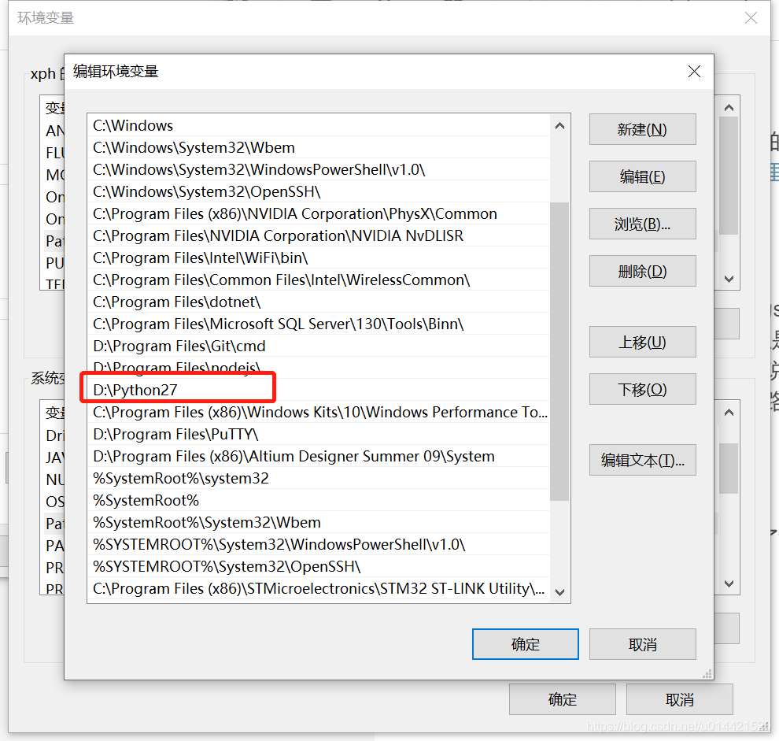
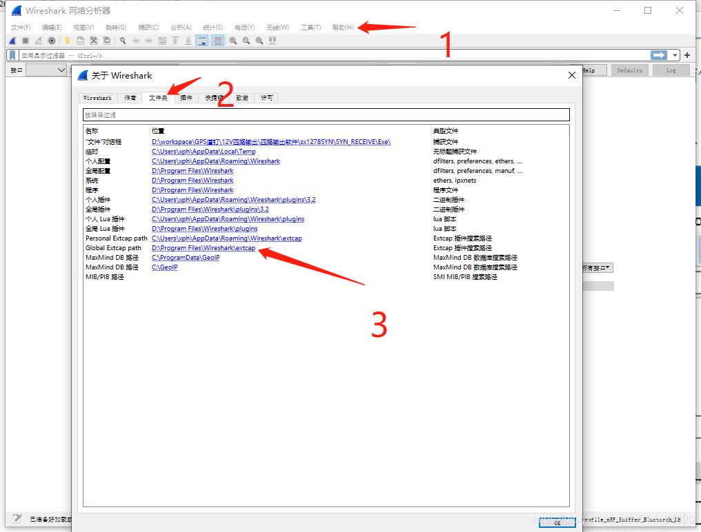
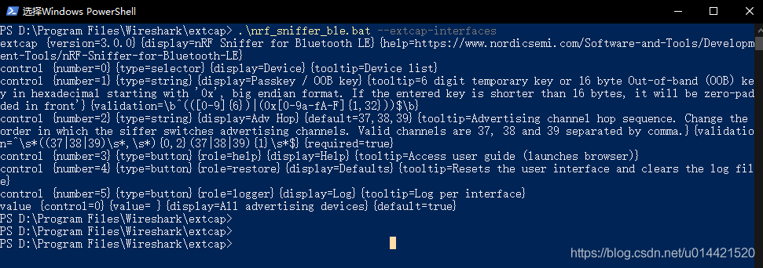
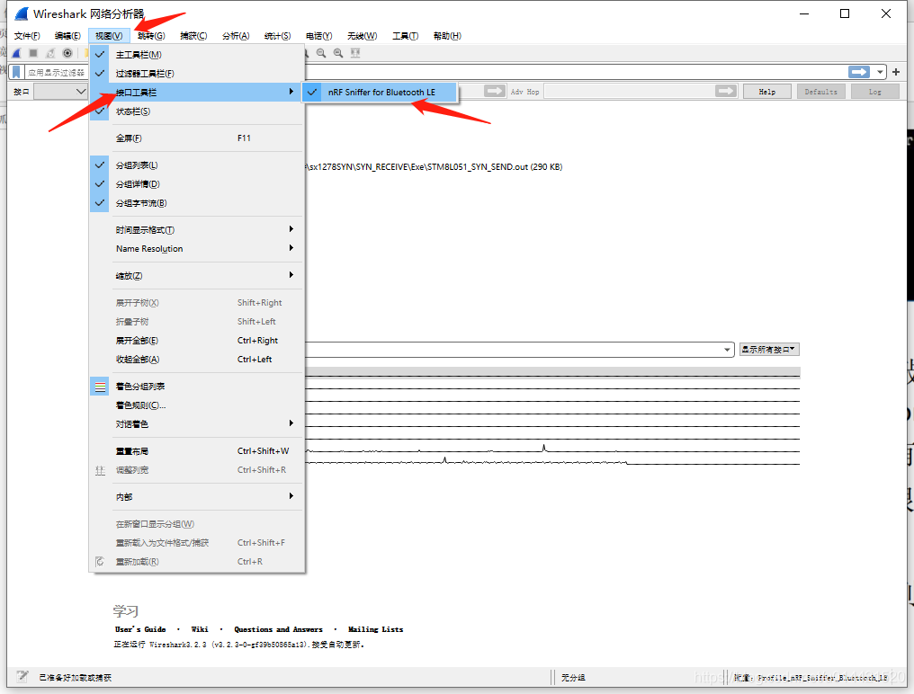
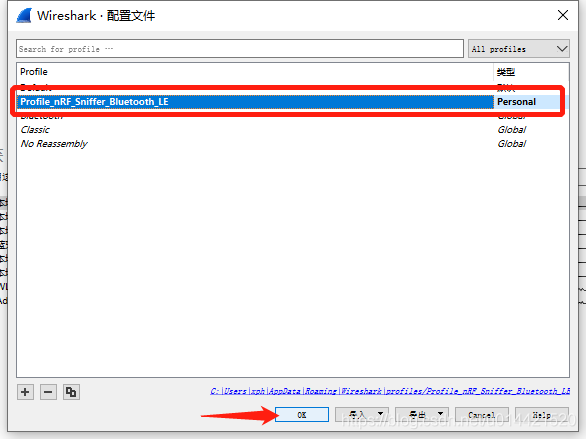
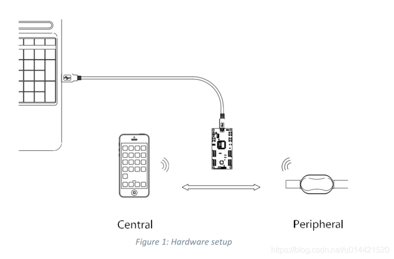
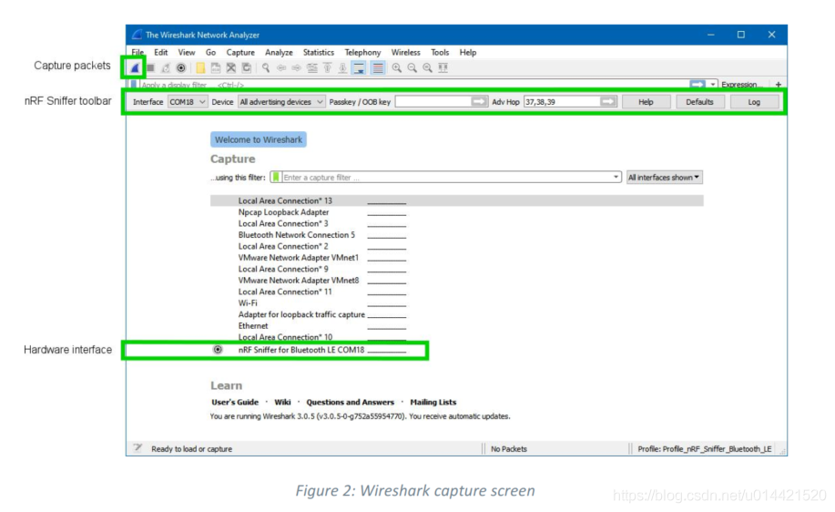

# 使用NRF52xx sniffer抓取BLE包
## 准备知识

### 为什么需要抓包

抓取BLE数据包就和我们做程序开发中打印log功能是一样的，我们可以方便快捷的获取程序运行状态以及出错后定位bug位置，无线通讯过程中的数据包都是通过电磁波以空气为介质进行传播的。所以，我们抓取空气中的数据包，对BLE开发来说，完全是0感知，不会有传统程序开发过程中log打印的太多影响程序的运行效率这样的顾虑。

### 软硬件准备
- NRF52832/52840硬件一个
- [wireshark](https://www.wireshark.org/download.html)
- [python ](https://www.python.org/download/releases/2.7/)
- [sniffer](https://infocenter.nordicsemi.com/index.jsp?topic=%252Fcom.nordic.infocenter.sdk5.v14.1.0%252Fnrf52810_user_guide.html)

## 固件烧录
准备nRF52xx的开发板一块，找到sniffer里面的hex文件夹，选取合适的固件烧录到nrf52xx开发板内，烧录方式同烧录其他程序一样，可以使用jlink或者[nRFgo-Studio](https://www.nordicsemi.com/Software-and-Tools/Development-Tools/nRFgo-Studio/Download)

## 软件安装

###  wireshark安装

wireshark是一款免费的并且功能强大的支持多协议的分析软件， 它的作用是把相应的协议数据包解析显示出来。点击[这里](https://www.wireshark.org/download.html)获取下载地址，安装一路点击下一步即可完成，没有啥特别需要注意的地方。

### python安装
安装python是为了安装pyserial，因为sniffer插件是通过pyserial来获取底层物理串口的数据。python版本可以是2.7也可以是最新的3.x，我系统中装了其他环境必须要用python2.7,所以就以python2.7为例来说明。

去[官网](https://www.python.org/download/releases/2.7/)获取python的安装包，然后一路next即可安装完成，安装完毕后配置系统环境变量，在Path里新建变量，如下图所示。

然后调出命令行验证是否安装成功。

### sniffer安装
sniffer是Nordic公司专门为nrf52xx系列蓝牙产品为wireshark编写的一个插件，只有改插件正确的安装，wireshark才能正常调用它并分析抓包数据。

在[官网](https://infocenter.nordicsemi.com/index.jsp?topic=%252Fcom.nordic.infocenter.sdk5.v14.1.0%252Fnrf52810_user_guide.html)找到sniffer安装包，里面包含了wireshark的sniffer插件还有nrf52xx的抓包固件，如下图所示。

- doc文件夹放的是一些说明文档和api参考手册，可以不看，影响不大。
- extcap文件夹里面是wireshark插件。
- hex文件夹里面是针对不同的nrf52xx芯片的抓包固件。
- profile是用来解析BLE数据包的。

#### 安装python需要的相关软件
- 打开命令行，定位到`..\nrf_sniffer_for_bluetooth_le_3.0.0_129d2b3\extcap\`
- 键入 `pip3 install -r requirements.txt` ，安装python需要依赖的软件，主要是安装pyserial。
- 完成后关闭命令行

#### 把sniffer capture tool文件拷贝到wireshark的外部插件文件夹

- 运行wireshark
- 单击帮助->关于wireshark->文件夹

- 双击Global Extcap path 弹出一个文件夹，如下图所示

- 把`..\nrf_sniffer_for_bluetooth_le_3.0.0_129d2b3\extcap\`下的所有文件拷贝到这个文件夹内

#### 确认nRF sniffer可以正常运行
- 打开命令行，定位到刚才拷贝的那个文件夹下
- 输入`nrf_sniffer_ble.bat --extcap-interfaces` ，如果弹出下面的界面，则表示正常运行。

	如果弹出其他错误，请确认python环境是否安装正确，以及pyserial是否安装成功。

#### 在wireshark中使能nRF sniffer capture tool
- 打开wireshark
- 单击捕获->刷新接口列表 完成刷新

- 使能sniffer接口，然后就能看到nRF sniffer出现在下面的列表中了

### 在wireshark中添加抓包的profile
如果不添加这个profile，wireshark抓到的数据包将不会解析成BLE数据包的格式，这给分析带来无尽的痛苦。

－单击　帮助－＞关于wireshark ->文件夹

- 双击个人配置，弹出文件夹，将`Profile_nRF_Sniffer_Bluetooth_LE`文件夹拷贝到该路径下的`profiles`文件里。

- 拷贝完成的路径如下图所示。

- 点击 编辑->configuration Profiles

- 选中 `Profile_nRF_Sniffer_Bluetooth_LE` 点击ok

## 运行nRF抓包工具

把刚才烧录好的nrf52xx dangle插入电脑usb口，然后把需要抓取包的手机和蓝牙外设放到dangle附近，运行wireshark。

双击选择nRF Sniffer for Bluetooth LE COM18就可以抓包了。 不过请注意， 不同的电脑显示的COM口不一样， 只要是前面显示nRF Sniffer for Bluetooth LE就没问题。

## 基础使用指南
如果前面的配置都正确的话，现在应该可以抓到包了，基本的抓包界面如下图所示：

- Hardware interface
	- 显示当前可以用的所有设备， 假如USB口有一个抓包工具则显示一个COM口号； 如果有多个，则显示多个COM口号。

- Device list
	- 如果你选择”All advertising devices ”， 则显示周围所有在广播的蓝牙设备； 如果下拉选择指定设备， 则只显示从该设备抓取的数据。 如果在抓包过程中重新下拉选择另外的设备， 则当前的数据会丢失。

- Passkey and OOB key
	- 在某些连接加密的应用， 连接 的时候需要输passkey或者OOB key,在这个位置输入后， 然后点回车。

- Advertising hop sequence
	- 在默认情况下， 抓包工具按先37信道， 再38信道， 最后39信道的顺序抓广播包。 如果用户不按这个顺序抓， 则在这里修改即可。 修改完成后请记得按回车键。

- RSSI filter
	- 根据信号强度过滤。 可以直接在过滤器栏里面输入rssi >=xxx来进行过滤。 如果被抓到的包大于等于XX这个信号强度， 则显示出来； 如果小于这个强度， 则不显示。

### 使能BLE数据包着色
使能BLE数据包着色，分析协议更方便，具体设置如下：

更具体的[使用技巧](https://www.cnblogs.com/unrulife/p/10818259.html)，请参阅这位大佬写的blog。

## 常见问题及解决方法
### python 软件包下载失败
- 换pip源为清华源
- 增加timeout时间
- 翻墙

### wireshark找不到nRF sniffer for Bluetooth LE
- 查看设备管理器COM口是否存在，没有则拔插dangle或者重新安装串口驱动
- 抓包固件是否烧录正确
- 重启wireshark