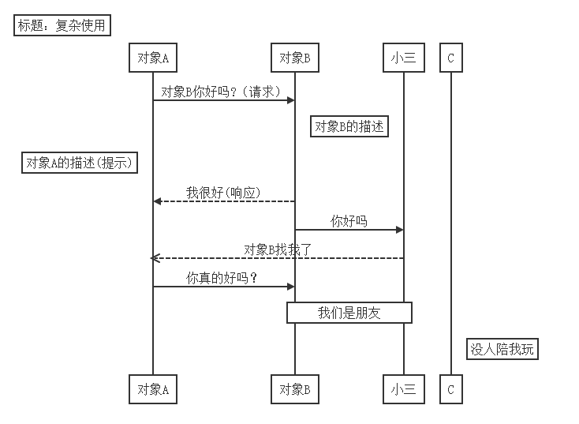

# 如何用markdown 画流程图

## Introduce

利用markdown画流程图是比较方便的，但是暂时还不支持github显示，不过最近用起来写代码流程图的时候极其方便，当然如果你需要画专业一点的流程图的话，可能visio和xmind是比较好的选择。

这边我记录一下流程，我觉得markdown比较适合于自己对一些代码流程不是特别清晰的，需要把代码逻辑理清楚的情况：

一共流程图有三种：

- flow 流程图（flowchart）这种写代码流程用的比较多
- sequence流程图 这种蓝牙中用的比较多
- mermaid流程图，这种能画的就比较多了，分样式流程图和样式时序图，也可以画甘特图


### flowchart

这种一般有基本判断的需要用直线连起来的。

先看下文本下面的内容：这个需要用源码形式粘贴，类似于插入code代码段的格式。关键字在`flow`

```
​```flow
st=>start: 开始框 
op=>operation: 处理框
cond=>condition: 判断框(是或否?)
sub1=>subroutine: 子流程
io=>inputoutput: 输入输出框
e=>end: 结束框

st->op->cond
cond(yes)->io->e
cond(no)->sub1(right)->op
​```
```

这个时候我们可以看到下面的图


**语法规则：**

- 上面用来定义流程图元素的，相当于c语言中的变量定义
- 后面部分用来连接的流程图走向的

#### 定义元素的语法规则

> tag=>type: content:>url

上面这段例程就是这段

```
st=>start: 开始框 
op=>operation: 处理框
cond=>condition: 判断框(是或否?)
sub1=>subroutine: 子流程
io=>inputoutput: 输入输出框
e=>end: 结束框
```

说明：

- tag就是一个命名，或者是一个简称，需要唯一性一般为缩写
- type用来定义标签类型，由于名称任意指定，则需要用type类指定，相当于关键字，c语言里面的类型
- type类型有： start  end  operation  subroutine  condition inputoutput
- content 是图片中显示的文字，特别注意，冒号和文本之间一定有个空格
- url是个超链接，可以点击图片直接跳转到超链接，写法如下：`st=>start: 开始框 :>http://www.baidu.com`

#### 链接流程图元素

后面代码：

```
st->op->cond
cond(yes)->io->e
cond(no)->sub1(right)->op
```

这样看就简单多了，直接用->来连接的，有几点说明：

- 使用-> 来连接连个元素
- condition类型后面跟yes和no两个分支，
- 每个元素可以指定分支走向有四种 left right top bottom

参考网址https://github.com/adrai/flowchart.js

### sequence

- `Title:标题` ：指定时序图的标题

- `Note direction of 对象:描述` ： 在对象的某一侧添加描述，`direction` 可以为 `right/left/over` ， `对象` 可以是多个对象，以 `,` 作为分隔符

- `participant 对象` ：创建一个对象

- `loop...end` ：创建一个循环体

- ```
  对象A->对象B:描述
  ```

   

  ： 绘制A与B之间的对话，以实线连接

  - `->` 实线实心箭头指向
  - `-->` 虚线实心箭头指向
  - `->>` 实线小箭头指向
  - `-->>` 虚线小箭头指向

例子：

```
​```sequence
Title:时序图示例
客户端->服务端: 我想找你拿下数据 SYN
服务端-->客户端: 我收到你的请求啦 ACK+SYN
客户端->>服务端: 我收到你的确认啦，我们开始通信吧 ACK
Note right of 服务端: 我是一个服务端
Note left of 客户端: 我是一个客户端
Note over 服务端,客户端: TCP 三次握手
participant 观察者
```

样子：


再看一个复杂的应用

```
​```sequence
Title: 标题：复杂使用
对象A->对象B: 对象B你好吗?（请求）
Note right of 对象B: 对象B的描述
Note left of 对象A: 对象A的描述(提示)
对象B-->对象A: 我很好(响应)
对象B->小三: 你好吗
小三-->>对象A: 对象B找我了
对象A->对象B: 你真的好吗？
Note over 小三,对象B: 我们是朋友
participant C
Note right of C: 没人陪我玩
​```
```

图片



### mermaid

mermaid相当于新的流程图了，包含了上面两种，可以说比较全面了

这个语法相当的博大精深，这边我就不具体的介绍了，感兴趣的可以参考下面的连接，还是挺复杂的。不过简单用用也是挺方便的。

推荐一个在线编辑的网址，也有很多样例，可以玩玩：

https://mermaid-js.github.io/mermaid-live-editor/

参考自：
https://mermaidjs.github.io/
https://blog.csdn.net/suoxd123/article/details/84992282

