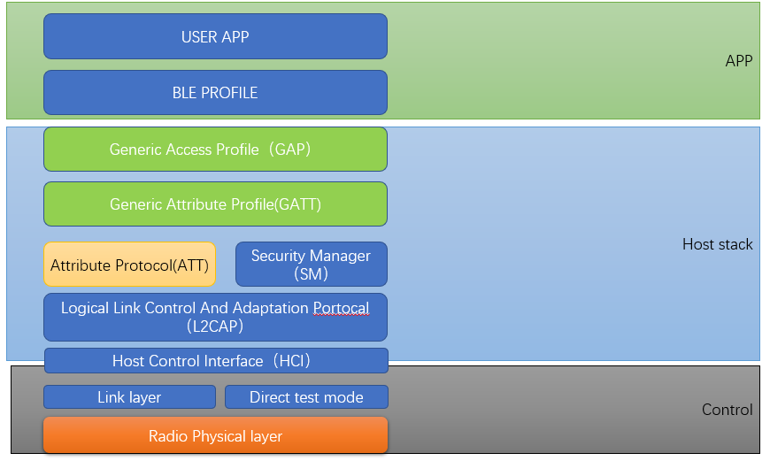
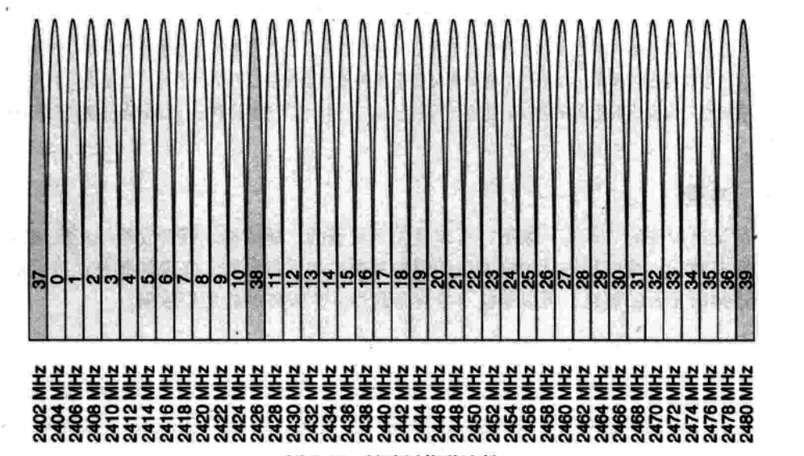
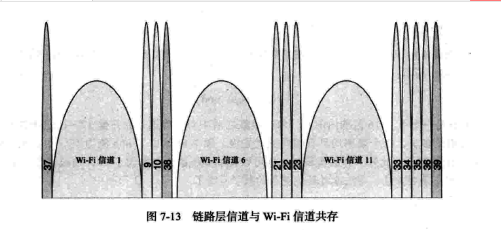
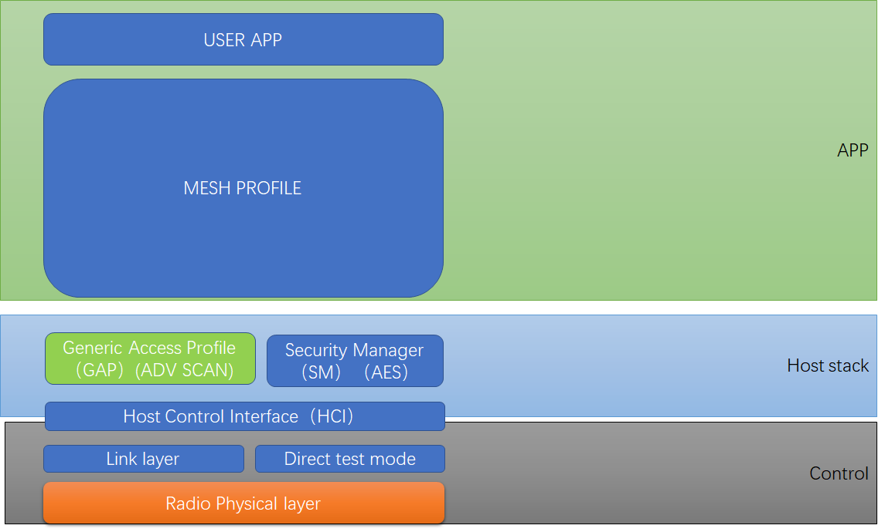

# 蓝牙基本知识介绍

       说到蓝牙就离不开蓝牙协议栈 core spec，我们基本上平时说的蓝牙4.0就是根据这个spec的版本号来的，比如下图版本为5.2，就是代表蓝牙标准5.2版本。这个spec里面规定了所有的蓝牙协议栈和RF的行为。包括上层和下层的。熟读这本spec，基本协议栈和底层control就知道如何来写了。

主要要知道以下内容：

V2: 这个是BR/EDR经典蓝牙的RF特性

V3: 这个是HOST 协议栈中所有的行为

V4: 这个是HOST 和control之间的通信行为

V6: 这个是所有LE蓝牙的RF特性以及

## 蓝牙基本框架图：

这个就是蓝牙中所有的模块，红色标注的地方就是BLE相关的模块

那我们详细的拿出这些模块介绍ble

### BLE 基本框架

框架介绍完了，就简单介绍下BLE 的RF 情况。

### BLE RF 信道分布

我们都知道蓝牙是用的2.4G的带宽，WIFI。

BLE一共有40个信道0~39

广播信道分为37 38 39

但是从图中可以看到，37 38 39并不是顺序分布的，其实这个广播信道的选择和WIFI的信道有一定的联系：

### ble 跳频

  BLE 跳频我就不展开讲了，主要就是两个蓝牙设备连上之后，会不停的在37个频道上跳来跳去，所以BLE相对于WIFI有比较好的抗干扰性。当然如果wifi实在太多，把所有信道占了，也会干扰到BLE

## BLE 角色

LE根据常用的场景分为以下4种角色

### Broadcaster role

只负责打各种广播

可以说只能发广播数据

* beacon
### Observer role

负责接收各种广播

可以说只能接收广播数据

### Peripheral role

这个角色就是接收连接的设备。通常是作为slave的，基本都是slave

通常会先发起广播让对端发现自己，然后对端来连接自己。

可以收发数据。

### Central role

通常是发起连接的设备，通常需要scan到设备的广播，之后和peripheral进行连接。

这个就是常说的主机方式。我们通常手机就是作为Central去连接各种le设备。

这4个角色我想说的是，对于固定的硬件，并不区分这些角色。之所以定义这些角色，主要为了区分不同的应用场景，某些固定的设备和协议栈通常都可以作为central和peripheral，或者其他角色，也可以各种不同的操作。也可以即当主机，又当从机。

## Mesh

Mesh常用的PB-ADV是Broadcaster 和Observer的结合体，只工作在37,38,39 

所以理论上，支持BLE的设备，都可以支持MESH，不需要修改硬件。

所以Mesh只需要两个BLE的接口，发广播，收广播。

但是，Mesh里面定义了很多model，所以Mesh 协议栈都相对来说比较大。而且要处理好发广播和收广播这两个接口的实时性，就是需要很准确。这里我就不展开了。

整体框架可以这么理解：

### 未讲内容：

### ble baseband跳频

### ble GATT profile

### ble GAP profile（LE)

### ble adv广播

### ble profile（hogp）hids

### ble profile （ancs)

