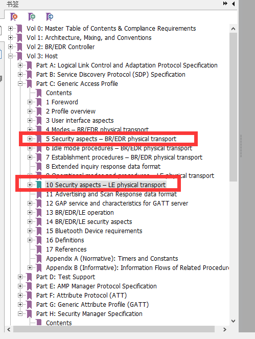
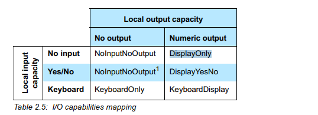
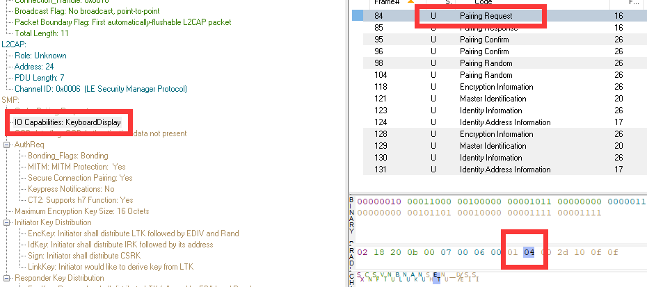
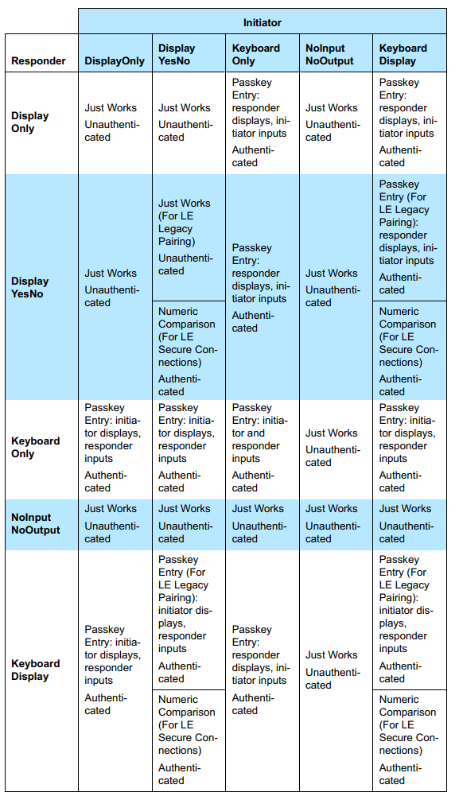
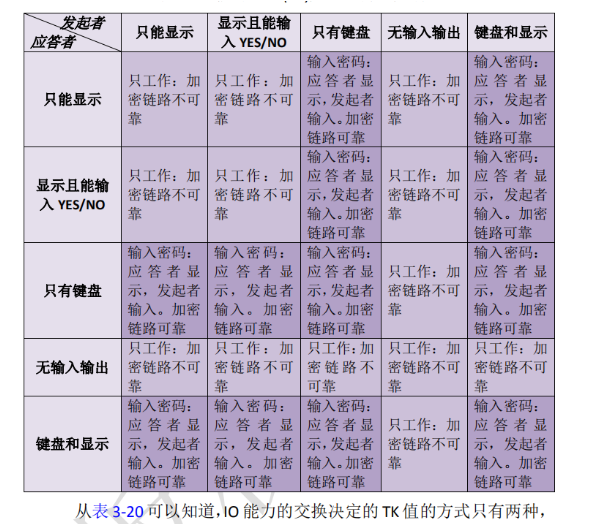

# SMP（BLE)

## 简介

### 前言

通常来讲，如果你只是实现简单的功能的话，可以暂时不用考虑SMP。当你需要做成产品的时候，就需要考虑是否需要使用SMP加密链路，需要什么样的安全等级策略了。

SMP相对比较枯燥，其实就是一个安全，因为蓝牙相对来说，标准都是开放的，所以为了防止黑客攻击，SIG需要制定出一套又一套的规范和安全等级，一旦出现漏洞，就要更新安全等级，或者添加一种算法来防止攻击。所以你会发现SMP的东西，有时候有点杂，有些feature都是独立的，安全性的内容包括：

- 认证
- 授权
- 完整性
- 机密性
- 隐私

## Core spec

在Core spec 5.2中，以下章节是重点内容：


GAP中也有部分章节是定义一些行为的：



基本主要内容就在这些章节中。

### GAP

GAP里面分LE和BR/EDR，今天就总结下LE的内容

#### GAP LE

LE的security分为以下内容：

- LE security mode 1
- LE security mode 2
- LE security mode 3
- Authentication 流程
- Authorization 流程
- 连接数据签名流程
- Authenticate 签名流程

#### 要求


这里的E看起来是不支持的意思，O是可选的，我们可以看到，几乎所有的security都是可选的。也就是说其实security客户可以选择有也可以选择没有，没有的时候也是交互正常的。

因为security涉及的概念非常多，我这边就不一一详细介绍了，想给大家普及一些基本概念

####  Authentication 认证

认证是一种缺认身份的方式，就是说对方来进行配对或者认证的时候，本机要确认是不是我要配对的那个人，而不是第三方的攻击者。认证一般采用意向两种基本方式：

- 初始服务请求
- 使用预先共享的秘钥来进行重新认证

具体什么是认证呢？

举个生活中最常见的例子，你第一次去银行办了一张银行卡，银行必须要检查你的身份证和人是否匹配，然后给你一张卡和让你设一个密码。这个过程中，办银行卡的过程就是认证的过程，之后不管谁拿了你的卡和密码，都能方便的取钱。

低功耗蓝牙中，开始认证有三种情况：

- 第一次手机和耳机进行配对的时候，这个过程涉及到一个秘钥
- 当手机重新和耳机进行连接的时候，这个时候其中任何一个设备都要向对端设备发送一个签名来验证身份，这个要不能让第三方伪造。该签名最好有个计数器，防止重放攻击。
- 当重新连接到以前绑定过的设备之后，两者都可以启动加密。加密之后，每发一笔包都要有完整性检查（MIC），使得双方都可以用共享的秘钥进行加密传输。

#### Authorization 授权

授权的意思呢，简单讲就是分配权限做某事。

打个比方就是：比如你进入某个公司之后，入职过程检查身份证和毕业证的过程就是认证的过程。而你进公司之后，并不是每个部门你都有访问权限的，你只能访问你所在部门你所应该有的权限，如果需要访问其他权限，需要上级给你授权。这个就是授权的大概意思。

就是蓝牙设备连上之后，你可以授权让你的设备访问通讯录，也可以不授权，它也能相互通信。

####  共享密钥

低功耗里面有很多密钥，各个密钥功能不一样。低功耗里面一共有5中密钥：

- 临时密钥（TK)
- 短期密钥（STK)
- 长期密钥（LTK)
- 身份解析密钥（IRK)
- 连接签名解析密钥（CSRK)

这边概念比较多，我暂时不展开。只强调一点，LTK是长期密钥，在设备断开连接再次进行认真的时候，这个是需要LTK进行加密的，所以我们如果要抓加了密的空气包，需要知道两边的LTK是什么，才能准确的抓到对应的包。


## 配对和绑定

为了保证蓝牙通信过程足够安全，两个设备刚开始，必须完成两件事： 首先，设备必须相互完成配对流程；其次，连接一旦加密，后面设备通信必须用协商好的密钥进行通信，这个时候两个设备就处于bonding状态。

### 配对（pairing）

配对有三个不同的阶段：

- 配对信息交换
- 链路认证
- 密钥分配

#### 配对信息交换

在一方启动配对流程最最开始的地方，例如甲方先发起配对，那么甲方第一步做的事情是发起pairing request，这笔request里面含有甲方的IO能力，这个时候乙方返回pairing response，这个时候乙方返回乙方的IO能力。

这边我们就来普及下什么是“IO 能力”

通俗的来讲，io capability就是这个设备的输入输出能力。


##### IO Capability

输入一共分为3种：

- 没有输入（这个没有选择拒绝的能力）
- 只能输入yes或者No （这个可以选择拒绝）
- 键盘（这个可以输入数字，也可以输入Yes或者No）


输出分为2种：

- 没有输出
- 可以输出数字

SIG根据这种组合，组合成以下的表格：



这就很明显了，这个表格中的所有值就是IO cabability

实际上btsnoopy中的表现就是下面的表格值：


好，我们现在有可以表述本机IO能力的值了，这个其实只是一方的能力值，也就是Pairing request里面的值，我们可以看下btsnoopy里面的值：



正好可以对上。

##### 认证

两边都亮出了自己的IO能力，那最后依谁的呢？这个其实是协议栈里面实现的，由发起方来控制

这个下面会讲到。

##### Out of Band (OOB)

OOB是蓝牙配对过程中，通过其他方式进行传递密钥的方式，这种方式不是特别常见，通常存在于具有NFC等短距离交互的设备中，这边提一下。

##### MITM(man in the middle)

中间人重放攻击保护，这个是一个标志位。是否置位代表是否需要防护中间人攻击

#### 配对方式

配对方式分为以下几种

##### Just work （legacy pairing）

这个是最基本的，也是最古老的，代表只是能简简单单工作就行，这种加密实际上并不是特别安全，没有额外的加密保密策略，仅仅是最最基本的策略。

##### Numeric comparison（Only for LE Secure Connections  ）

这个就是数值比较，这个是只有在LE secure Connection才会用到

##### Passkey Entry（legacy pairing）

这种加密也就是设备之间通过输入密钥的方式来进行相互加密，采用6位的数字密码来生成STK。

这是一种通过数字来比对的策略

##### Out of band（legacy pairing）

这个也是一种加密策略，就是不采用输入密钥的方式，而是采用短距离接触的方式交互key


##### LE legacy pairing Phase 2

这种属于一种加密性比较好的策略

##### LE Secure Connection pairing

这是一种比较新的加密策略，新的4.2以上的feature以上的才会采用，这种加密方式在空气中是不含有LTK的信息的，LTK保存在本地，双方本地进行存储LTK。

选择策略依照下面图表：



这张图表示了所有的可以选择策略，

参考了下别人的笔记：



我总结了一下大概的意思：

- 两边都没有键盘的话，只能要用just works的方式工作，这种工作不能认证。
- 一方有显示，另一方有键盘，这种情况，有显示的可以显示值，有键盘的可以输入值进行加密
- 一方有显示，另一方有键盘或者yesNo，这种情况才能考虑LE secure connection 加密（因为可以采用数值比较的方式）
- 这里面的unauthenticated的表格，都是代表该加密方式并未经过身份认证，是不安全的。

这个决策都是由发起者来决策的，发起者根据自己的pairing request里面的几个要素，和对端反馈上来的几个要素，进行决策选择配对的方式进行认证还是不认证。

### pairing 包要素

理解了一些基本概念，差不多可以了解一下代码如何完成这些步骤的


这张图解释了pairing request中的要素

- 第0个byte 是操作码， 0x01代表pairing request
- 第1个byte是IO能力，代表当前设备的IO能力，由上面[IO Capability](#IO Capability)
- 第2个byte是OOB data flag， 这个是专门给OOB使用的，可以暂时不用关心，一般是0代表不用OOB
- 第3个byte 是比较重要的，是AuthRequest TYPE
- 第4个byte是最大加密的key长度，这个通常不会改变，是16byte
- 第5个和第6个byte都是代表支持的key分发KEY相关

#### Auth request Type


##### Bonding_flag(2bits)

该位置1才会考虑后面KEY的分发，通常都是1，因为通常加密都是要开启该bit位的

##### MITM (1bit)

这个位置位代表本机是否需要MITM 保护

##### SC(1bit) Secure Connection

这个bit位比较重要，这个bit位是判断该设备是否支持LE Secure Connection的，如果两边该标志位都置1了，加密的时候必须要用到LE Secure Connection

##### keypress Notification(1bit)

这个标志位不常用，这个只有在双方都置1的时候，每次带有键盘的设备按键都会产生PDU来通知对方

##### CT2

这个是比较新的feature，h7 相关的。这边不介绍

#### 配对决策

上面包的要素中，需要提取以下几点信息

- IO capability
- OOB flag
- MITM flag
- SC flag

```merid

```


### 配对流程


### key分发

